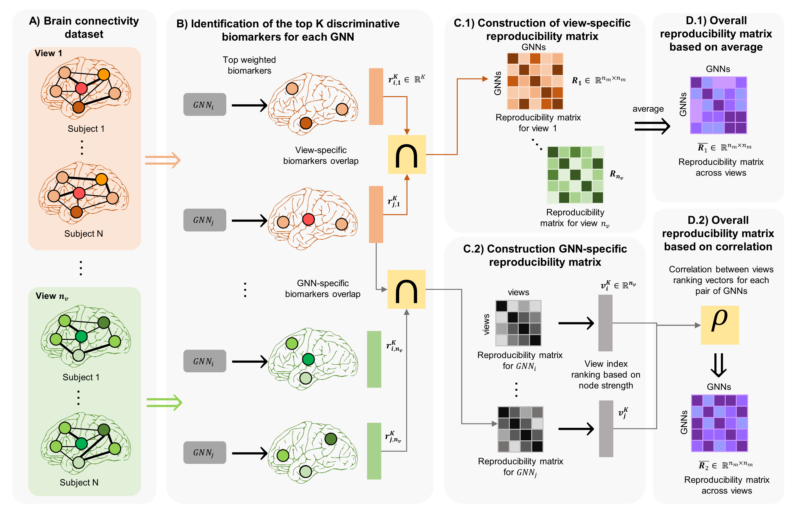
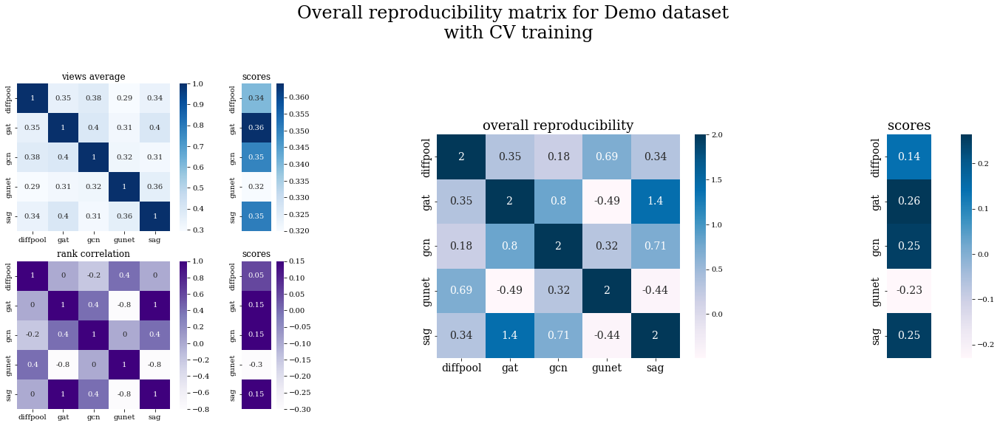

# RG-Select
RG-Select for GNN reproducibility assessment with datasets of multigraphs coded up in Python by Mohammed Amine Gharsallaoui. Please contact mohammedaminegh@gmail.com for further inquiries. Thanks.

This repository provides the official PyTorch implementation of the following paper:

<p align="center">
  
</p>


> **Investigating Reproducibility in Graph NeuralNetworks using Multigraph Data**

> Ahmed Nebli<sup>1</sup>, [Mohammed Amine Gharsallaoui](https://github.com/aminegha)<sup>1</sup>, Zeynep Gurler<sup>1</sup>, [Islem Rekik](https://basira-lab.com/)<sup>1,2</sup>


> <sup>1</sup>BASIRA Lab, Faculty of Computer and Informatics, Istanbul Technical University, Istanbul, Turkey


> <sup>2</sup>School of Science and Engineering, Computing, University of Dundee, UK
>
> **Abstract:** *Graph neural networks (GNNs) have witnessed an unprecedented proliferation in tackling several problems in computer vision, computer-aided diagnosis and related fields. While prior studies have focused on boosting the model accuracy, quantifying the reproducibility of the most discriminative features identified by GNNs is still an intact problem that yields concerns about their reliability in clinical applications in particular. Specifically, the reproducibility of biological markers across clinical datasets and distribution shifts across classes (e.g., healthy and disordered brains) is of paramount importance in revealing the underpinning mechanisms of diseases as well as propelling the development of personalized treatment. Motivated by these issues, we propose, for the first time, reproducibility-based GNN selection (RG-Select), a framework for GNN reproducibility assessment via the quantification of the most discriminative features (i.e., biomarkers) shared between different models. To ascertain the soundness of our framework, the reproducibility assessment embraces variations of different factors such as training strategies and data perturbations. Despite these challenges, our framework successfully yielded replicable conclusions across different training strategies and various clinical datasets. Our findings could thus pave the way for the development of biomarker trustworthiness and reliability assessment methods for computer-aided diagnosis and prognosis tasks. RG-Select code is available on GitHub at https://github.com/basiralab/RG-Select.*

This work is published in Neural Networks. Based on graph topology, RG-Select is a framework that evaluates the reproducibility of graph neural networks (GNNs). Our framework investigates the reproducibility using the learnt GNN weights. Studying the commonalities of the most discriminative biomarkers across GNN, RG-select assigns a reproducibility score for each model while incorporating the variations of many factors such as training strategies, edges (e.g., brain connectivity measures) and the number of top biomarkers to be selected. We have evaluated our model using cross-validation and few-shot approach with small- and large-scale datasets. In this repository, we release the code for the reproducibility evaluation for simulated vectors representing the learnt weights respective to different GNNs.  

# Installation

The code has been tested with Python 3, PyTorch 1.7.1 on Windows. GPU is not required to run the code. You also need other dependencies (e.g., numpy, pandas, matplotlib, seaborn) which can be installed via: 

```sh
$ pip install numpy
$ pip install torch
$ pip install pandas
$ pip install scikit-learn
$ pip install matplotlib
$ pip install seaborn
```

# Generating simulated data

We provide a demo code for the usage of RG-Select for GNN reproducibility assessment with datasets of multigraphs. In ```simulate_data.py```, we generate datasets of mutigraphs. The hyperparameters of multigraphs (e.g., number of nodes and number of views) can be varied by the user. In addition, the user can vary the distribution properties of the generated populations of graphs. 

You can generate the simulated data with the following command:

```bash
python simulate_data.py 
```
The simulated data will be saved in pickle format within the same directory of the code file.

# Simulated data

In order to use our reproducibility framework, you need to provide:
* the number of views.
* the number of nodes. 
* the standard deviations of populations of the two classes.
* the means of populations of the two classes.

These parameters will generate the dataset of graphs. These graphs are represented as 3-D numpy matrices. the output files are:
* labels: list containing the labels of the graphs.
* adjs: list contining the graphs represented by their adjacency matrices.

# GNN models
The GNN models included are:
* DiffPool: https://arxiv.org/abs/1806.08804
* SAGPool: http://proceedings.mlr.press/v97/lee19c.html
* GAT: https://arxiv.org/abs/1710.10903
* g-U-Nets: http://proceedings.mlr.press/v97/gao19a.html
* GCN: https://arxiv.org/abs/1609.02907

# Running GNN models:
After simulating the dataset, you can run the GNN models by the following command:

```bash
python demo.py 
```

This file runs the GNN models above with the different training settings. You can tune general parameters such as the dataset, the number of views and the models included. You can also tune specific hyperparameters of models by running the files ```main_gat.py```, ```main_gcn.py```, ```main_gunet.py```, ```main_diffpool.py``` and ```main_sag.py```. These files contain methods for training the models and hyperparameters such as number of layers, learning rate and dimensions of specific layers. 

# Extracting the reproducibility scores

After running the GNNs, the file ```extract_results.py``` extracts the weights of the learnt GNNs. Then, it computes the overlap scores with different combinations of settings such as views, training strategies, top biomarkers to be considered. The output file is a pandas dataframe containing reproducibility matrix of the GNNs used. This dataframe is saved as a pickle file.

# Plotting the heatmaps of the reproducibility matrices

After saving the dataframes with ```extract_results.py```, now you run the file ```plot_heatmaps.py``` to visualize the heatmaps of the reproducibility matrices. Note that the displayed plots contain heatmaps of 3 matrices:
* Reproducibility matrix using the views average method.
* Reproducibility matrix using the rank correlation method.
* Overall reproducibility matrix.

<p align="center">
  
</p>

# Related references
Identifying the best data-driven feature selection method for boosting reproducibility in classification tasks:
Georges, N., Mhiri, I., Rekik, I., & Alzheimer’s Disease Neuroimaging Initiative: Identifying the best data-driven feature selection method for boosting reproducibility in classification tasks. 
[https://www.sciencedirect.com/science/article/pii/S0031320319304832] (2020)


# Citation

If our code is useful for your work please cite our paper:

```latex
@article{nebli2022quantifying,
  title={Quantifying the reproducibility of graph neural networks using multigraph data representation},
  author={Nebli, Ahmed and Gharsallaoui, Mohammed Amine and G{\"u}rler, Zeynep and Rekik, Islem and Alzheimer’s Disease Neuroimaging Initiative and others},
  journal={Neural Networks},
  volume={148},
  pages={254--265},
  year={2022},
  publisher={Elsevier}
}
```

# RG-Select on arXiv

https://arxiv.org/abs/2109.02248


# License
Our code is released under MIT License (see LICENSE file for details).

